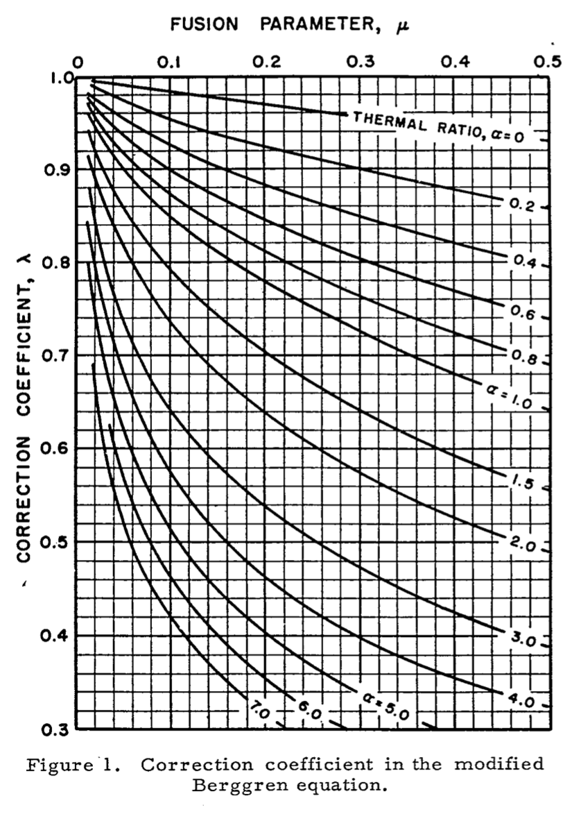

# A Modified Berggren Frost Depth Computer for a Changing Alaskan Climate

## Testing and Development

Streamlit must be installed locally before running this repository.

The development environment resides at `dev_tools/environment.yml`. To use this environment when testing and running the app locally, use the following chain of commands to manage the environment.

From within the project repository root directory:

- Create a `conda` environment
  - `conda env create -f environment.yml`
- Activate the environment
  - `conda activate frost-depth`
- Run the app locally
  - `streamlit run app.py`
- Update the dev environment (if you need to add a package)
  - `conda env export --no-builds | grep -v "^prefix: " > environment.yml`

The production environment is the top-level `environment.yml` file. This environment is used to deploy the app on the Streamlit Community Cloud. There are likely other ways to configure this deploy, but this was the path of least friction at time of the initial development work. This is a minimal environment, and the framework (Streamlit) is not required as a dependency by the Streamlit Community Cloud. This environment is minimal because the deploy is more likely to be successful if the Streamlit Community Cloud platform is able to independently resolve dependencies and system-level libraries. To update this environment after adding a package, use the following command:

`conda env export --no-builds --from-history | grep -v "^prefix: " > environment.yml`

## Frost Depth Background

From Bianchini and Gonzalez (2012)<sup>[[6]](#6)</sup>:

"The design of pavement structures in cold climates must account for the changes in soil properties due to the influence of freezing and thawing cycles. The calculation of frost depth is a fundamental step during the design and evaluation of pavement structures by the U.S. Department of Defense (DoD). The DoD uses the modified Berggren (ModBerg) equation to compute the frost penetration depth."

The functions provided here compute the ModBerg frost depth in the same fashion as demonstrated in the The Unified Facilities Criteria (UFC) 3-130-06<sup>[[5]](#5)</sup>. Note that other tools (in particular the Pavement-Transportation Computer Assisted Structural Engineering (PCASE)) offer numerical solutions to the ModBerg equation and thus predict different values than the solutions described in the UFC and presented here. See Bianchini and Gonzalez (2012)<sup>[[6]](#6)</sup> for a discussion of those differences.

## Implementation

### Structure

The Python code in `modberg.py` computes the frost depth. A simple web app (`app.py`) built using the Streamlit platform enables a web based graphical user interface to the tool.

### Assumptions

- Frost depth is computed for a single layer of homogenous isotropic soil.
- Heat flow is one-dimensional with the entire soil mass at its mean annual temperature prior to the start of the freezing season. The surface temperature changes suddenly as a step function from the mean annual temperature to a temperature v<sub>s</sub> degrees below freezing and remains at this new temperature throughout the entire freezing season.
- The initial ground temperature is assumed to uniformly equal the mean annual air temperature. The upper boundary condition is represented by the surface freezing index.
- The coefficient λ considers the effect of the temperature changes in the soil mass and is a function of the fusion parameter μ and thermal ratio α. Traditionally, λ is found "manually" by using values of μ and α to consult a chart such as this one from Aldrich and Paynter (1966)<sup>[[3]](#3)</sup>:

 

Here λ is found using equation _2-33_ from Aldrich (1953)<sup>[[2]](#2)</sup> implemented like so:

```python
def compute_coeff(mu, thermal_ratio):
    """Compute the lambda coeffcient (dimensionless).
    Args:
        mu: the fusion parameter (dimensionless)
        thermal_ratio: thermal ratio (dimensionless)
    Returns
        lc: the lambda coeffcient value (dimensionless).
    """
    lc = 1.0 / (np.sqrt(1 + (mu * (thermal_ratio + 0.5))))
    return round(lc, 2)
```

This method removes manual consultation of the above figure and should produce coefficients suitable for high latitudes (where the thermal ratio is low), though likely will over estimate frost depths for more temperate climates.

### User Inputs

- Soil Factors
  - Thermal Conductivity
  - Dry Density
  - Gravimetric Water Content
- Climate Factors
  - Mean Annual Temperature
  - Air Freezing Index
  - n-factor to convert air freezing index to surface index
  - Duration of the Freezing Season

## References

<a id="1">[1]</a> W. P. Berggren, “Prediction of temperature-distribution in frozen soils,” Trans. AGU, vol. 24, no. 3, p. 71, 1943, doi: 10.1029/TR024i003p00071.

<a id="2">[2]</a> H. P. Aldrich and H. M. Paynter, “Analytical Studies of Freezing and Thawing of Soils,” Arctic Construction and Frost Effects Laboratory, Corps of Engineers, U.S. Army, Boston, MA, First Interim Technical Report 42, Jun. 1953.

<a id="3">[3]</a> H. P. Aldrich and H. M. Paynter, “Depth of Frost Penetration in Non-Uniform Soil,” Conducted for CORPS OF ENGINEERS, U. S. ARMY by U.S. ARMY MATERIEL COMMAND COLD REGIONS RESEARCH & ENGINEERING LABORATORY, Hanover, New Hampshire, Special Report 104, Oct. 1966.

<a id="4">[4]</a> “ARCTIC AND SUBARCTIC CONSTRUCTION CALCULATION METHODS FOR DETERMINATION OF DEPTHS OF FREEZE AND THAW IN SOILS,” Joint Departments of the Army and Air Force, USA, Technical Manual Tm 5-852-6 / AFR 88-19, Volume 6, Jan. 1988.

<a id="5">[5]</a> “Calculation Methods for Determination of Depth of Freeze and Thaw in Soil: Arctic and Subarctic Construction,” U.S. Army Corps of Engineers, United Facilities Criteria UFC 3-130-06, Jan. 2004. [Online]. Available: https://www.wbdg.org/FFC/DOD/UFC/INACTIVE/ufc_3_130_06_2004.pdf

<a id="6">[6]</a> A. Bianchini and C. R. Gonzalez, “Pavement-Transportation Computer Assisted Structural Engineering (PCASE) Implementation of the Modified Berggren (ModBerg) Equation for Computing the Frost Penetration Depth within Pavement Structures,” Geotechnical and Structures Laboratory U.S. Army Engineer Research and Development Center, Vicksburg, MS, Final ERDC/GSL TR-12-15, Apr. 2012. doi: 10.21236/ADA559915.

<a id="7">[7]</a> H. P. Aldrich, “Frost Penetration Below Highway And Airfield Pavements,” p. 26.
